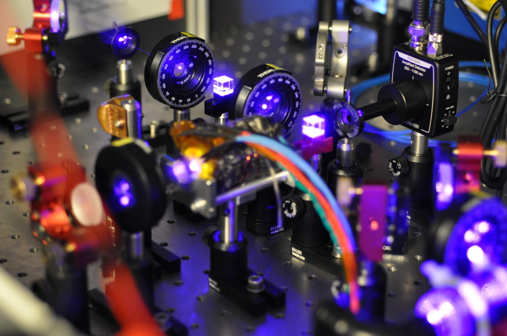

# Thermal attenuation noise of optical power from a 420nm light source in hot 85,87Rb vapor.

___
## The Idea
The project mainly uses an experiment which was build up during my master
thesis which will be finished in a few weeks. The experiment aims to do
doppler free absorption spectroscopy in the 6**P** manifold. This is possible
due to the recent advancements in GaN diode laser technology[1-3],
for which the 2014 Nobel price was awarded[4] and allows
for a compact laser at 420.3 nm in a Littrow external cavity diode laser
design (ECDL). This is beneficial for us since the ECDL inhibits a very
low linewidth (<150 kHz) and therefore does not perturb our modulated
deviations. The modulation of perturbations is made via a hot gas cell
with a natural mix of Rubidium inside it. Natural abundances of Rubidium
is subdivided in only to isotopes[5]:

| Isotope         | Abundance    |
| --------------- | ------------ |
| 87Rb | 28.487(11) % |
| 85Rb | 71.513(11) % |

Those two have very similar atomic transitions although their hyperfine structure
splitting is very different caused by different nuclear spins[6].
So one can use the gas cell

which is heated from two ceramic facet heaters as well as multiple heating wires around its core.
The cell is capable of producing up to 200°C. Also the inside and outside is strongly shielded
against magnetic fields and isolated against heat loss.

The cell will serve as the power attenuation inside the setup. There are multiple options to
drive the laser through it with a resonant frequency, or non resonant, or with different temperatures
of polarizations.

As seen the light passes the cell two times in crossed polarizations and will then be detected
by a amplified photodiode.

The guess now is that due to deflection, gas diffusion/movement and spurious reflections/diffractions
a gaussian formed power attenuation will be modulated onto the laser beam. This should be able to
be registered with the photodiode.

___
## Proposed evaluation
In the project description it was proposed to invert the assumed gaussian distributed
data to a uniform distribution through the means of inverting the box mueller
transform[7]. But it turned out, the transformation is neither bijective
nor fully invertable to different solution branches. So it was necessary to find
a way of inverting the data. It turned out the solution is well known and easy to
find[8]. One can just apply the cumulated distribution function with the
estimated parameters of the distribution. This is an easy to do evaluation and served
as a reliable method.

___
## First measurements

The first measurement was just made on the amplified, electrical noise of the photodiode.
It was set to a gain of 20 dB and the voltages where recorded.
While it initially looked good the eye

and even produced data which passed all statistical
tests but one (in a monobit rounding evaluation) it was later found to be unreliable. This
was due to the found discretization of the ADC on the electronics board which makes
discrete 300 nV steps.

___
### Real laser measurements

The first laser measurements where found to be a bit shaky. This is caused by the laser
stabilization which prefers a stable frequency with modulation of the diode current.

Nevertheless the small deviations are encoded in a much higher frequency in the data.
Therefore a Fouriertransformation was made and as seen, the lower pseudo frequency parts
where truncated and the result was transformed back.

This yielded a nice distribution. However, it was found that the best matching Gaussian
distribution (red) does not match the histogram very well. This holds for a Lorentz
distribution too. But it turned out, that the data follows a Voigt distribution which
is a convolution of the latter mentioned distributions. This makes sense and could have
been thought of already in the project description rather than just assuming a gaussian one.
This hints to homogeneous and inhomogeneous broadening processes like pressure and doppler
broadening respectively[9, 10].

Applying the CDF of the Voigt distribution then yields the uniform distributed data which
can be tested again.

Sadly the data does not passes the monobit test and in turn also not the cumulative sum tests.
The compression test is also not passed as well as in the electric noise measurements.
One could try the better evaluation method from the electrical noise evaluation but there
where not enough datapoints to do that since the Fouriertransform truncated a lot of it.

___
### Conclusions
In total this project has to be seen as a negative result in its current shape. It created
random numbers but their quality was not that great compared to other methods. One could
increase the quality with more measurements as well as other evaluation methods but this
was not subject of this project. I suspect the correlations of successive measurements where
just to strong and in turn pulled down the random number quality.
However, the project showed that it is possible to create random numbers out of the
power attenuation of a laser beam in hot Rubidium vapor. The numbers are from low
quality but due to their quantum nature, can be used as a nice high entropy source for seeds
or key creation.

___
### References

1. Nakamura, S., Mukai, T. & Senoh, M. High-power GaN pn junction blue-lightemitting diodes. _Japanese Journal of Applied Physics_ **30**, L1998 (1991).

2. Nakamura, S., Mukai, T. & Senoh, M. Candela-class high-brightness InGaN/AlGaN double-heterostructure blue-light-emitting diodes. _Applied Physics Letters_ **64**, 1687{1689 (1994).

3. Akasaki, I. & Amano, H. Breakthroughs in improving crystal quality of GaN and invention of the p{n junction blue-light-emitting diode. _Japanese journal of applied physics_ **45**, 9001 (2006).

4. Nakamura, S. Nobel Lecture: Background story of the invention of efficient blue InGaN light emitting diodes. _Reviews of Modern Physics_ **87**, 1139 (2015).

5. Lide, D. R. CRC _handbook of chemistry and physics: a ready-reference book of chemical and physical data_ (CRC press, 1995).

6. Steck, D. A. _Rubidium 87 D line data_ 2001.

7. Scott, D. W. Box Muller transformation. _Wiley Interdisciplinary Reviews: Computational Statistics_ **3**,177 179. issn: 1939-0068 (2011).

8. "Harry49" _math.stackexchange_ https://math.stackexchange.com/a/2344086/373704 (2017).

9. Demtröder, W. _Laserspektroskopie: Grundlagen und Techniken_ (Springer-Verlag, 2007).

10. Demtröder, W. _Laserspektroskopie 2: Experimentelle Techniken_ (Springer-Verlag,
2013).
