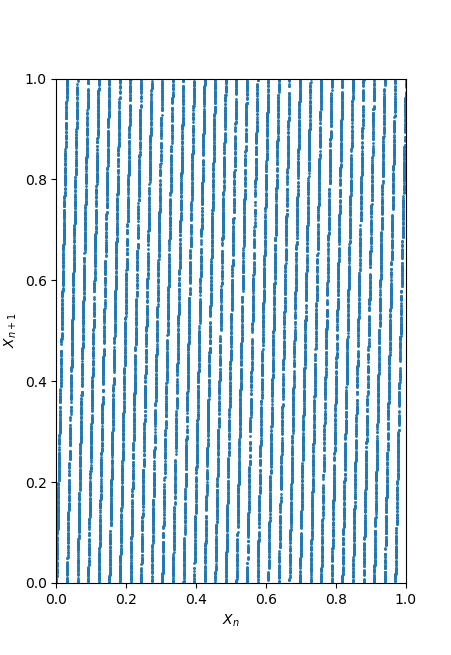

<h1 id="linear-congruential-generators">Linear Congruential Generators</h1>

Linear Congruential Generators (or LCGs in short) are algorithms that can be used to generate pseudo random numbers. To generate a random number with an LCG we need three discrete parameters and a starting value. The parameters are

<ul>
<li>the <em>modulus</em> \(M\), with \(0 &lt; M\),</li>
<li>the <em>multiplier</em> \(A\), with \(0 &lt; A &lt; M\) and</li>
<li>the <em>increment</em> \(C\), with \(0 \leq C &lt; M\).</li>
</ul>

The starting value is usually denoted as \(X_{0}\) with \(0 \leq X_{0} &lt; M\).

To now generate a new random number from a starting point \(X_{n}\) (for the sake of generality we set \(n = 0\)), we simply calculate

\[X_{n+1} = A * X_{n} + C \mod M \mathrm{.}\]

Since all values are discrete the result of the linear transformation \(R = A * X_{n} + C\) is again a discrete number. Through the modulo operation \(X_{n+1} = R \mod M\) we assert \(0 \leq X_{n+1} &lt; M\).

<h2 id="a-few-examples">A few examples</h2>

To get a feeling for this formula we choose a couple of parameters and see what we get for the output.

<h3 id="m-9-a-2-c-0-x_0-1">\(M = 9\), \(A = 2\), \(C = 0\), \(X_{0} = 1\)</h3>

These parameters generate the following sequence of numbers:

\[ 2, 4, 8, 7, 5, 1, 2, 4, 8, 7, 5, 1, 2, 4, 8, 7, 5, 1, 2, 4, \dots \]

We can see that it repeats itself very quickly. This is of course due to the small modulus we choose. Furthermore we can see that it does not cover all the values in the interval \(\left(0, M\right)\). If we now choose a starting value that is any number in the sequence above, we will obtain the same sequence again. So let’s choose a value that has not occurred yet.

<h3 id="m-9-a-2-c-0-x_0-3">\(M = 9\), \(A = 2\), \(C = 0\), \(X_{0} = 3\)</h3>

These parameters generate the following sequence of numbers:

\[6, 3, 6, 3, 6, 3, 6, 3, 6, 3, 6, 3, 6, 3, 6, 3, 6, 3, 6, 3, \dots\]

This sequence is even less random, as it only takes on the values \(3\) and \(6\). Now we have exhausted all values in \(\left(0, M\right)\).

We can already tell that to obtain truly randomly <em>looking</em> numbers, we need to pick a larger modulus.

<h3 id="m-251-a-33-c-0-x_0-1">\(M = 251\), \(A = 33\), \(C = 0\), \(X_{0} = 1\)</h3>

We obtain

\[33, 85, 44, 197, 226, 179, 134, 155, 95, 123, 43, 164, 141, 135, 188, 180, 167, 240, 139, 69, \dots\]

This appears to be a much better sequence. At first glance we can not spot repeating values and we are also unable to predict a successor to some value. The only obvious shortcoming is the small modulus. A modulus of \(M = 251\) causes the values to only be in the range \(\left( 0, M\right)\). After \(250\) numbers the values will definitely start repeating.

<h2 id="testing-for-randomness">Testing for randomness</h2>

Our third example already makes it hard to tell if these numbers are <em>good</em> pseudo random numbers. But what makes a sequence of pseudo random numbers <em>good</em>? The German Bundesamt für Sicherheit in der Informationstechnik (BSI) recommends a series of statistical tests [<a href="#schindler">2</a>]. These tests look at the binary sequence of the random numbers.

The binary number sequence of <a href="#m-251-a-33-c-0-x_0-1">example three</a> would be \[ 00100001, 01010101, 00101100, 11000101, 11100010, 10110011, 10000110, \dots \]

To perform the following tests we take all binary numbers and concatenate them into a long string. This string is then truncated to be exactly \(20000\) bits long. This binary string is denoted \(b\), individual bits are denoted \(b_{i}\) (for the \(i\)th bit). \[ b = 00100001010101010010110011000101111000101011001110000110\dots \]

There are a total of five statistical tests recommended:

<h3 id="monobit-test">Monobit Test</h3>

We sum up all bits in the string \(b\).

\[ X_{b} = \sum_{i=1}^{i=20000} b_{i}\mathrm{.}\]

To pass the monobit test the result \(X_{b}\) has to fulfill \(9654 &lt; X_{b} &lt; 10346\). In words: the sequence is binary, made up of ones and zeros. Either appearance is equally probable (exactly \(0.5\)). Therefore we expect the roughly the same number of ones as we have zeros.

<h3 id="poker-test">Poker Test</h3>

We divide the binary sequence into segments of four bits each, \[ 0010, 0001, 0101, 0101, 0010, 1100, 1100, 0101, 1110, 0010, 1011, \dots \] We can turn each segment into a four bit number between \(0\) to \(15\). There are exactly \(16\) different numbers. We now count the occurrence of each of these numbers, denoted \(s_{i}\) with \(i \in [0, 15]\). With this we calculate the sum \[X_{s} = \sum_{i=0}^{i=15} s_{i}^{2} - 5000\mathrm{.}\]

To pass the poker test we expect \(1.03 &lt; X_{s} &lt; 57.4\) for the result of the sum. This is in essence a \(\chi^{2}\)-test with 15 degrees of freedom.

<h3 id="runs-test">Runs Test</h3>

We look at the binary sequence and count sequences of ones and zeros. In the sequence \[ 1, 0, 0, 1, 1, 1, 0, 1 \] we have three sequences of length \(1\) (the first \(1\) and the \(0\) and the \(1\) at the end), one sequence of length \(2\) (\(0, 0\)) and one sequence of length \(3\) (\(1, 1, 1\)). The occurrences of each length has to follow a distribution if the sequence is truly random. For a sequence of length \(20000\) this distribution is as follows.

<table>
<thead>
<tr class="header">
<th>Sequence length</th>
<th style="text-align: right;">Occurrence interval</th>
</tr>
</thead>
<tbody>
<tr class="odd">
<td>1</td>
<td style="text-align: right;">2267-2733</td>
</tr>
<tr class="even">
<td>2</td>
<td style="text-align: right;">1079-1421</td>
</tr>
<tr class="odd">
<td>3</td>
<td style="text-align: right;">502-748</td>
</tr>
<tr class="even">
<td>4</td>
<td style="text-align: right;">233-402</td>
</tr>
<tr class="odd">
<td>5</td>
<td style="text-align: right;">90-223</td>
</tr>
<tr class="even">
<td>6 and more</td>
<td style="text-align: right;">90-233</td>
</tr>
</tbody>
</table>
<h3 id="long-runs-test">Long Runs Test</h3>

The Long Runs Test is essentially the same as the runs test. In this we just see if there are sequences of length \(34\) or longer in the binary sequence. If there are the test has failed.

<h3 id="autocorrelation-test">Autocorrelation Test</h3>

The Autocorrelation Test tests sub sequences of the original binary sequence and looks how much they depend on each other (or how “similar” they are).

<h4 id="an-explanation">An explanation</h4>

Let’s take the sequence \[ b = 0, 0, 1, 0, 0, 0, 0, 1, 0, 1, 0, 1, 0, 1, 0, 1, 0, 0, 1, 0, 1, 1, 0, 0, \dots \] and create from it two sub sequences of length \(10\). We let \(s_{i}\) be the sub sequence of length \(10\) that was created by removing the <em>first</em> \(i\) bits from the sequence \(b\) and then removing everything that makes \(s_{i}\) longer than length \(10\). \[s_{0} = 0, 0, 1, 0, 0, 0, 0, 1, 0, 1\] \[s_{1} = 0, 1, 0, 0, 0, 0, 1, 0, 1, 0\] The next step is to perform a bitwise XOR operation on the two sequences, \[s_{0 \oplus 1} = s_{0} \oplus s_{1} = 0, 1, 1, 0, 0, 0, 1, 1, 1, 1\] XOR is a logic operation with the following logic table \[0 \oplus 0 = 0\mathrm{,} \quad 0 \oplus 1 = 1\mathrm{,} \quad 1 \oplus 0 = 1\mathrm{,} \quad 1 \oplus 1 = 0\] Then the sum of \(b_{0 \oplus 1}\) is calculated. For a totally uncorrelated original binary sequence we expect a value of roughly \(5\) (half the length of the sub sequences).

<h4 id="the-actual-test">The actual test</h4>

For the actual test the sequences are \(5000\) bits long. We take bits \(b_{i}\) from the original sequence \(b\) and calculate for \(n \in [1, 5000]\) \[X_{n} = \sum_{j=1}^{j=5000} b_{j} \oplus b_{j+n}\] The test has passed when \(2326 &lt; X_{n} &lt; 2674\) for each \(n\). To avoid confusion it should be noted that the test is only performed on the first \(10000\) bits of the original sequence.

<h4 id="example-plots">Example plots</h4>
<figure>
<figcaption>Parameters chosen from <a href="#m-251-a-33-c-0-x_0-1">example three</a>. The modulus of the LCG was choosen to be very small. The result is strong autocorrelation, the sequence repeats after roughly 2000 bits (plot goes to 0).</figcaption>
</figure>
<figure>
<figcaption>Autocorrelation of truly random numbers (in this case generated by a quantum random number generator).</figcaption>
</figure>

In the first image we can see the autocorrelation values of a binary sequence from an LCG where the modulus was choosen to be too small. The result is a strong autocorrelation. The second image shows the autocorrelation for a binary sequence that was generated by a quantum mechanical random number generator. Because of the quantum nature these numbers are truly random. This can also be seen in the autocorrelation plot.

<h2 id="pitfalls-of-lcgs-the-spectral-test">Pitfalls of LCGs – The Spectral Test</h2>

Statistical tests are a good way of assessing some basic distribution properties of (pseudo random) binary sequences. In the case of pseudo random binary sequences generated from LCGs however, they don’t necessarily tell the whole story. Let’s generate a random number sequence \(X_{n}\) (the parameters for the LCG are \(X_{0} = 1\), \(A = 33\), \(C = 0\) and \(M = 251232131\); for these parameters all statistical tests pass) and look at the random number sequence \(X_{n}\) plotted against the random number sequence \(X_{n+1}\) (the same sequence, just shifted to the right by one number).

What do we see? Even though the statistical tests all pass, we see that the random numbers seem to fall onto a set of lines. We can find similar pictures in higher dimensions. For three dimensions we would have to plot \(X_{n}\) versus \(X_{n+1}\) versus \(X_{n+2}\). The random numbers would then fall on planes (or hyperplanes in four or more dimensions).

These lines are determined by our choice of parameters for the LCG. Since the increment \(C\) only shifts the random numbers it only affects the positions of the lines, not the distance or the angle. The distance and angle of the lines is determined by the multiplier \(A\) and the modulus \(M\).

The closer the lines are to each other, the higher quality the random numbers are. This is because a sequence of random numbers will fill the space (the squared interval \((0, M) \times (0, M)\) in two dimensions). This is what the Spectral Test does: it finds the distance between adjacent lines (or (hyper-)planes).

For a detailed explanation please refer to the excellent (although technical) chapter on the Spectral Test in <a href="#knuth">Knuths book [1] (pp. 89)</a>.

<h2 id="performing-the-tests">Performing the tests</h2>

To perform the tests that were introduced we can use the Python program downloadable <a href="https://github.com/Klump3n/lcg_tests">here</a> <a href="#plock">[3]</a>. We pick a couple of “famous” LCG parameters and perform tests in a range around them.

<h3 id="randu">RANDU</h3>

A very famous and bad example is the LCG implementation <code>RANDU</code> by IBM, that has been used since the 1960s <a href="#knuth">[1]</a>. The faults were discovered by 1963 but <code>RANDU</code> has been noted to have been in use up until 1999. <code>RANDU</code> is the reason that results from simulations from that era should always be taken with a grain of salt.

The parameters for <code>RANDU</code> are \[A = 65539\mathrm{,} \quad C = 0\mathrm{,} \quad M = 2^{31}-1\mathrm{.}\]

First we look at the statistical tests. Yellow colors indicate that all tests have passed. For the proposed parameter all statistical tests have passed. We notice a reduction in passed tests for LCGs that have \(A = 65536 = 2^{16}\). In general tests with even parameters \(A\) and \(M\) seem to fail more often. 

The Spectral Test is performed for the dimensions \(2\) to \(5\). These are still computationally easy. We note that for the chosen interval no parameter combination has passed the tests for every dimension \(2\), \(3\), \(4\) and \(5\). On the top right corner we spot two combinations that passed \(3\) out of \(4\) tests. 

Ideally the chosen parameters pass the statistical tests as well as the spectral test. For <code>RANDU</code> and the chosen interval around the proposed paramter combination, no combination passed all the statistical tests and the Spectral test for more than \(2\) dimensions. 

The conclusion is that <code>RANDU</code> is a very bad LCG and should not be used.

<h3 id="c-lcg-implementations">C++ LCG implementations</h3>

A more recent example is the LCG implementation found in the C++ standard <a href="#cpp">[4]</a>. There exist two different parameter choices, <code>minstd_rand0</code> and <code>minstd_rand</code>.

<h4 id="minstd_rand0">minstd_rand0</h4>

The parameters for <code>minstd_rand0</code> are \[A = 16807\mathrm{,} \quad C = 0\mathrm{,} \quad M = 2^{31} - 1\mathrm{.}\]

<figure>
<figcaption>Results for the statistical tests for <code>minstd_rand0</code> in an interval of \(A = 16807 \pm 10\) and \(M = (2^{31} - 1) \pm 10\).</figcaption>
</figure>
<figure>
<figcaption>Results for the Spectral Test for <code>minstd_rand0</code> in an interval of \(A = 16807 \pm 10\) and \(M = (2^{31} - 1) \pm 10\).</figcaption>
</figure>
<figure>
<figcaption>Results for the Spectral Test in places where <em>ALL</em> statistical tests passed for <code>minstd_rand0</code> in an interval of \(A = 16807 \pm 10\) and \(M = (2^{31} - 1) \pm 10\).</figcaption>
</figure>
<h4 id="minstd_rand">minstd_rand</h4>

The parameters for <code>minstd_rand</code> are \[A = 48271\mathrm{,} \quad C = 0\mathrm{,} \quad M = 2^{31} - 1\mathrm{.}\]

<figure>
<figcaption>Results for the statistical tests for <code>minstd_rand0</code> in an interval of \(A = 48271 \pm 10\) and \(M = (2^{31} - 1) \pm 10\).</figcaption>
</figure>
<figure>
<figcaption>Results for the Spectral Test for <code>minstd_rand0</code> in an interval of \(A = 48271 \pm 10\) and \(M = (2^{31} - 1) \pm 10\).</figcaption>
</figure>
<figure>
<figcaption>Results for the Spectral Test in places where <em>ALL</em> statistical tests passed for <code>minstd_rand0</code> in an interval of \(A = 48271 \pm 10\) and \(M = (2^{31} - 1) \pm 10\).</figcaption>
</figure>
<h1 id="references">References</h1>
<ul>
<li><a name="knuth">[1]</a> Donald E. Knuth. <em>The Art of Computer Programming, Volume 2: Seminumerical Algorithms</em>. Addison-Wesley, 1997.</li>
<li><a name="schindler">[2]</a> Werner Schindler. <em>Functionality classes and evaluation methodology for deterministic random number generators</em>. <a href="https://www.bsi.bund.de/SharedDocs/Downloads/DE/BSI/Zertifizierung/Interpretationen/AIS_20_Functionality_Classes_Evaluation_Methodology_DRNG_e.pdf" class="uri">https://www.bsi.bund.de/SharedDocs/Downloads/DE/BSI/Zertifizierung/Interpretationen/AIS_20_Functionality_Classes_Evaluation_Methodology_DRNG_e.pdf</a>, 1999.</li>
<li><a name="plock">[3]</a> Matthias Plock. <em>lcg_tests. A small analysis suite for linear congruential generators for a university seminar.</em> <a href="https://github.com/Klump3n/lcg_tests" class="uri">https://github.com/Klump3n/lcg_tests</a>, 2019.</li>
<li><a name="cpp">[4]</a> CPP Reference. <em>std::linear_congruential_engine</em> <a href="https://en.cppreference.com/w/cpp/numeric/random/linear_congruential_engine" class="uri">https://en.cppreference.com/w/cpp/numeric/random/linear_congruential_engine</a>, looked up July 6, 2019.</li>
</ul>
