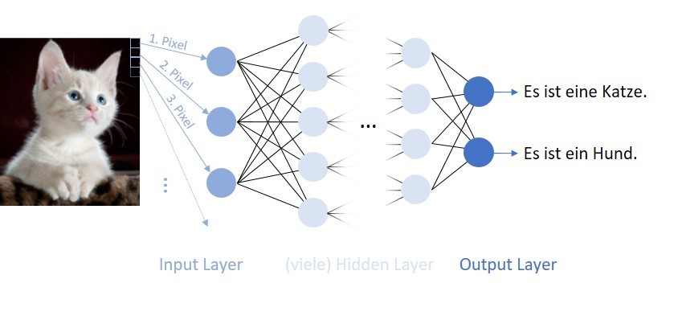
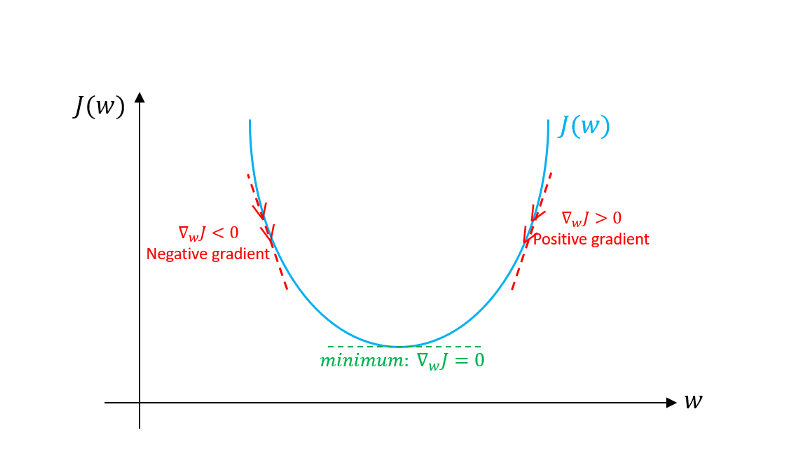
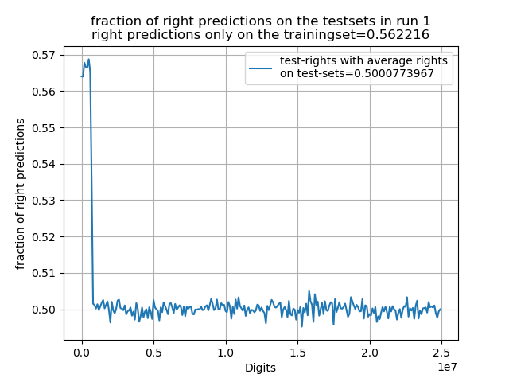
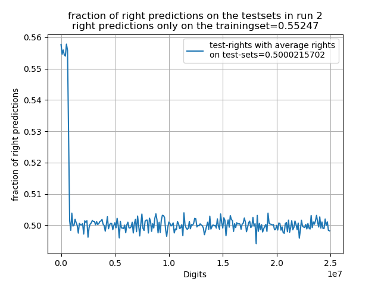
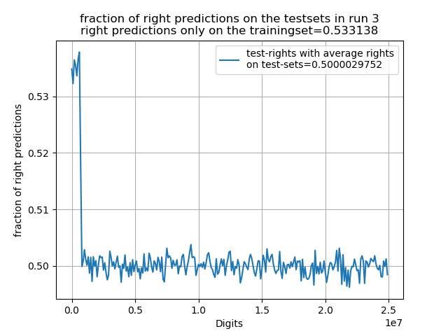
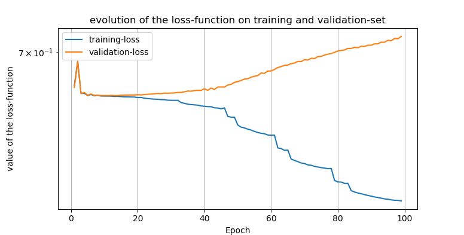

# 
Untersuchung der Zufälligkeit von π mithilfe von Neuronalen Netzwerken

  
## 
Einleitung

In diesem Q-Tutorium sollte sich mit Zufallszahlen beschäftigt werden. Nun stellt sich die Fragen: was sind Zufallszahlen? Wie lassen sie sich einteilen? Wie werden sie erzeugt? und wie lässt sich ihre Güte überprüfen?

Hier nun ein kurzer Überblick wie sich Zufallszahlen (random numbers-RN) Einordnen lassen und wie sie erzeugt werden können.
Grob lassen sich RN in 'echte'-Zufallszahlen (true random numbers-TRN) und 'pseudo'-Zufallszahlen (pseudo random numbers-PRN) einteilen. Diese werden über ihre jeweilige Erzeugung mithilfe des genutzten Zufallszahlen-Generators (random number generator-RNG) Unterschieden.
RNG's lassen sich grob in zwei Kategorien einteilen. Zum einen gibt es die algorithmischen Pseudo RNG's (PRNG's) und zum anderen physikalische- True RNG's (TRNG's).

[Bild Quelle](https://www.researchgate.net/figure/Classification-of-random-number-generators_fig1_299824248)

Kurz gesagt handelt es sich bei PRNG's um einen Algorithmus bzw. eine mathematische Formel die eine deterministische, periodische Sequenz von Zahlen erzeugt, die die Eigenschaften einer zufälligen Zahlenfolge approximiert, welche jedoch vollkommen durch einen zu Beginn festgelegten Zustand, der auch Seed genannt wird, bestimmt ist.
Diese strikt deterministischen Generatoren sind per Definition nicht 'echt' Zufällig, da keine Informationsmenge vollkommen Zufällig sein kann, wenn sie durch eine kürzere genau bestimmt wird. Eine echte Zufallszahl sollte selbst bei Kenntnis aller Details über den Generator immer noch vollkommen unvorhersehbare Bits erzeugen. Es zählen allerdings auch Systeme als TRNG's wenn sie zwar theoretisch unter Kenntnis aller Bedingungen Berechenbar sind, diese allerdings aufgrund ihrer Komplexität heutzutage noch nicht vorhersagbar sind.
Es gibt eine große Anzahl an Algorithmen, wobei deren Periodizität leicht erhöht werden kann, indem ein längerer Seed mit n Bits gewählt wird, der im besten Fall zu einer Periodizität von zwei hoch n führen kann.
Trotz ihrer nicht wirklichen Zufälligkeit, welche sich in starken langreichweitigen Korrelationen äußert, sind PRNG's wichtig aufgrund ihrer leichten, billigen und schnellen Erzeugung, sowie ihrer Reproduzierbarkeit und perfekter Balance zwischen Nullen und Einsen.

Im Gegensatz zu den PRNG's stehen die durch vollkommen nichtdeterministische physikalische Prozesse erzeugten TRNG's. Diese sind aufgrund ihrer echten Unvorhersehbarkeit besser für Kryptographie geeignet. Dabei werden verschiedene physikalische Prozesse genutzt, um Zufallszahlen zu erzeugen. Einige davon sind: Radioaktiver Zerfall, Zehner Rauschen, Johnson Rauschen, Photonen Pfad Teilung mithilfe von Strahlteilern oder Photonen Ankunftszeiten. Alle diese haben gemein, dass es sich um generelle stochastische Prozesse handelt deren Komplexität es unmöglich macht sie genau vorherzusagen.
TRNG's lassen sich grob in 4 Kategorien einteilen: auf Rauschen basierenden RNG's, frei laufenden Oszillatoren, auf Chaos basierenden RNG's und Quanten RNG's.

Zufallszahlen haben viele Anwendungsbereiche, besonders in der Kryptographie, beim Glücksspiel oder bei Simulationen. Die Überprüfung der Güte solcher Zufallszahlen ist deshalb eine wichtige aber auch schwierige Aufgabe. 
Hierzu gibt es bereits viele Tests, welche jeweils einzelne Eigenschaften von Zufallszahlen überprüfen, jedoch für sich allein selten eine Aussage über die Güte der Zufallszahlen geben.
So kann eine Zahlenfolge einen Test bestehen, jedoch in vielen anderen Durchfallen oder bei Untersuchung von Teilstücken einer
Folge von Zufallszahlen einige bestehen und andere nicht. Hier liegt vor allem das Problem vor, dass immer nur eine Endliche 
Folge vorliegt. Wirklicher Zufall allerdings kann nur bei einer unendlich langen Folge zu 100% überprüft werden.

Eine völlig andere Idee als bei herkömmlichen Tests, in denen jeweils Gewisse Kriterien überprüft werden, ist die Nutzung von 
maschinellem Lernen (machine learning-ML). Dabei sind besonders Neuronale Netzwerke weit verbreitet und erbringen erstaunliche 
Ergebnisse in vielen Bereichen. Die Idee ist also, ein Neuronales Netzwerk zu nutzen um Pseudo,- 
aber auch Echte Zufallszahlen zu überprüfen und gegebenenfalls versteckte Korrelationen zwischen den Daten aufzudecken. 
So soll deren Güte aufgrund der Vorhersagbarkeit der Zahlenfolgen (welche im Falle von binären Bitfolgen natürlich 
eigentlich bei 50% liegen sollte) überprüft werden.

## 
Was ist ML und ein Neuronales Netzwerk eigentlich?

Im ML gibt es verschiedene Disziplinen. Einmal das Lernen mit beschrifteten oder markierten Daten (labeled data), also mit bekannten Zielwerten, was als überwachtes-Lernen (supervised learning) bezeichnet wird und das Lernen an Daten ohne Zielwerte, was auch als unüberwachtes-Lernen (unsupervised learning) bezeichnet wird.

Hier soll sich mit dem 'supervised learning' und besonders mit Neuronalen Netzwerken beschäftigt werden. Beim 'supervised learning' wird ein Problem durch einen Input und einen dazugehörigen markierten Output beschrieben. Als Beispiel kann hier eine Folge von Zufallszahlen genommen werden. Der Input könnten die ersten 5 Zahlen der Folge sein, der zugehörige Output die 6. Zahl der Folge. Ein anderes, weitaus bekannteres, Beispiel wäre die Klassifikation eines Bildes (also die Pixel als Inputs) ob eine Katze oder ein Hund dargestellt ist (Output).

[Bild Quelle](https://blog.iao.fraunhofer.de/spielarten-der-kuenstlichen-intelligenz-maschinelles-lernen-und-kuenstliche-neuronale-netze/)

Diese Paare von Inputs und Outputs werden auch Trainings-Set oder Trainings-Daten genannt. Ein grober Aufbau eines einfachen Netzwerks ist im oben dargestellten Bild zu sehen. Der grundlegende Baublock ist ein so genanntes Neuron (Im Bild oben die Kreise). Diese sind jeweils mit allen Neuronen der nächsten Ebene verbunden. In einem Neuron wird eine gewichtete Summe über alle Inputs (auch Aktivierungen) aus der vorherigen Ebene und den Gewichten (Parametern) gebildet und mit einer [Aktivierungs-Funktion](https://medium.com/the-theory-of-everything/understanding-activation-functions-in-neural-networks-9491262884e0), z.B. Sigmoid oder [ReLu](https://www.kaggle.com/dansbecker/rectified-linear-units-relu-in-deep-learning), zur nächsten Ebene transferiert  und dort wieder alle Aktivierungen der vorherigen Ebene als Inputs für die einzelnen Neuronen genutzt. Dabei werden alle Ebenen bei denen es sich nicht um die Input oder Output Ebene handelt als 'verborgene' Ebenen (hidden layers) bezeichnet.
  
Das Ziel ist, dass das Neuronale Netzwerk, was im Prinzip nur eine komplizierte nichtlineare Funktion mit sehr vielen Parametern ist, die bekannten Inputs auf die zugehörigen Outputs abbildet. Als Maß für die Güte der Vorhersage des Netzwerks auf den Trainingsdaten wird eine [Kostenfunktion](https://ml-cheatsheet.readthedocs.io/en/latest/loss_functions.html) verwendet, die im einfachsten Fall die Differenz zwischen dem Input und Output-label berechnet und dann quadriert.
Um nun bessere Vorhersagen zu treffen, werden mithilfe eines [Optimierungsalgorithmus](https://towardsdatascience.com/types-of-optimization-algorithms-used-in-neural-networks-and-ways-to-optimize-gradient-95ae5d39529f) die Parameter des Netzwerks so optimiert, dass die Kostenfunktion minimiert wird. Für die meisten Optimierungsalgorithmen werden die Gradienten benötigt, hierzu wird der [Rückpropagations-Algorithmus](http://neuralnetworksanddeeplearning.com/chap2.html) genutzt. Der Optimierungsalgorithmus benötigt mehrere Iterationen über das Trainingsset (Epochen), um sich immer Näher dem Minimum der Kostenfunktion, welche von den Netzwerk-Parametern und den Trainingsdaten abhängt, zu nähern. Eine Veranschaulichung des häufig genutzten Optimierungsverfahrens ['Gradient-Descent'](https://towardsdatascience.com/gradient-descent-algorithm-and-its-variants-10f652806a3) ist in der folgenden Abbildung zu sehen.
  

[Bild Quelle](https://towardsdatascience.com/gradient-descent-algorithm-and-its-variants-10f652806a3)

Bei dem Fitten eines bekannten Zusammenhangs zu Messdaten eines Experimentes zur Bestimmung von physikalischen oder chemischen Eigenschaften passiert im Prinzip genau dasselbe, nur das die Funktionen in der Regel weitaus weniger Parameter aufweisen.
Die Idee hinter dem Training des Netzwerks ist es, wenn es genug Trainingsbeispiel gesehen/gelernt hat, sollte es ein grobes Verständnis besitzen was eine Katze und einen Hund ausmacht und dieses auf neue und unbekannte Inputs, also in diesem Fall Bilder, Anwenden können und diese hoffentlich richtig Klassifizieren. Hierzu ist es wichtig das Netzwerk nicht zu perfekt auf die Trainingsdaten anzupassen, da es sonst dazu kommen kann, dass es nicht mehr gut neue, unbekannte Beispiele klassifiziert. Dies wird auch überfitten (over-fitting) genannt und bringt viele Spitzfindigkeiten beim Training eines Netzwerkes mit sich.
Alle Teilblöcke die bisher beschrieben wurden (die Anzahl an Ebenen und Neuronen, die Aktivierungsfunktionen, die Kostenfunktion, das Optimierungsverfahren, die Anzahl an Epochen die Trainiert werden, die Wahl der Inputs,...) werden auch Hyperparameter genannt und maßgeblich für der Performance des Netzwerks verantwortlich.
   
   
Dies ist natürlich nur eine sehr kurze und oberflächliche Beschreibung. Es gibt viele verschiedene Arten von Netzwerken die für verschiedene Arten von Daten besser geeignet sind (z.B. [Convolutional neural network](https://en.wikipedia.org/wiki/Convolutional_neural_network) für Bildverarbeitung oder [Recurrent neural network](https://en.wikipedia.org/wiki/Recurrent_neural_network) für Sequenzielle Daten). Außerdem existieren viele weitere Ebenen die Beispielsweise das Training sehr tiefer Netzwerke Verbessern ([batch normalization layer](https://towardsdatascience.com/batch-normalization-in-neural-networks-1ac91516821c)), das überfitten verhindern ([dropout layer](https://medium.com/@amarbudhiraja/https-medium-com-amarbudhiraja-learning-less-to-learn-better-dropout-in-deep-machine-learning-74334da4bfc5)) oder dem Netzwerk ermöglichen einige Ebenen zu 'überspringen' ([residual blocks](https://towardsdatascience.com/residual-blocks-building-blocks-of-resnet-fd90ca15d6ec)).
Zudem ergeben sich weitere Spitzfindigkeiten beim [Optimierungsprozess](https://towardsdatascience.com/types-of-optimization-algorithms-used-in-neural-networks-and-ways-to-optimize-gradient-95ae5d39529f) selbst, bei dem es viele verschiedene Algorithmen gibt und viele weitere Hyperparameter gewählt werden können.
   
   
In den folgenden Kapiteln wird davon ausgegangen, dass ein grundlegendes Verständnis von dem Aufbau eines Neuronalen Netzwerks bekannt ist.
In der Recherche zu diesem Projekt und besonders für ein etwas tieferes Verständnis von Neuronalen Netzwerken waren die kostenlosen Kurse von [Adrew Ng.](https://www.youtube.com/watch?v=CS4cs9xVecg&list=PLkDaE6sCZn6Ec-XTbcX1uRg2_u4xOEky0) auf YouTube, sowie [Vorlesungsskripte](http://cs229.stanford.edu/syllabus.html) besonders hilfreich.

## 
Idee und erste Tests

Bei den ersten Untersuchungen wurde sich besonders an dem Paper ['Learning from Pseudo-Randomness with an
Artificial Neural Network– Does God Play Pseudo-Dice?'](https://arxiv.org/ftp/arxiv/papers/1801/1801.01117.pdf) von Fenglei Fan und Ge Wang orientiert.
In dieser Arbeit wurden die Nachkommastellen der transzendenten und somit auch irrationalen Zahl π auf ihre Zufälligkeit untersucht. Man geht davon aus, dass die Nachkommastellen der Zahl π vollkommen Zufällig sind und deshalb keine Periode enthalten dürften. Somit sollte man theoretisch, wenn man die Nachkommastellen der Zahl Pi erraten möchte eine 10%tige Chance haben, die richtige Ziffer (digit) vorherzusagen. 

In der Arbeit wurden die Nachkommastellen in eine Binäre Bit-Folge umgewandelt, indem alle Stellen mit Ziffern 0-4 zu 0 und alle Ziffern 5-9 zu 1 umgewandelt wurden. Laut der Arbeit sollte dies die Zufälligkeit erhalten und die Vorhersage mithilfe des Netzwerks vereinfachen.
Diese Binäre Bit-Folge wurde nun in ein Trainings-Set umgewandelt, indem jeweils 6 Nachkommastellen als Input und die 7. als Output verwendet wurden. Es wurde ein relatives kleines Netzwerk mit 2 verborgenen Ebenen mit 30 und 20 Neuronen und die ersten 40,007 Nachkommastellen als Trainings-Set genutzt.

Ein Ergebnis dieser Arbeit ist, dass das Netzwerk nach dem Trainings-Prozess (mit 40 Epochen) mit 51%ger Wahrscheinlichkeit die richtige 7. Nachkommastelle auf dem Trainings-Set vorhersagt. Bei genauerer Überlegung ist dies jedoch nicht verwunderlich, denn umso größer ein Netzwerk, desto mehr Möglichkeiten bestehen, dass sich die Parameter des Netzwerks beim Training gerade so anpassen, dass sie das gesamte Trainings-Set beschreiben können. So sollte, wenn ein besonders großes (bzw. tiefes) Netzwerk mit vielen Neuronen, Ebenen und Inputs genutzt wird, es möglich sein, auf dem Trainings-Set weit über 50% richtige vorhersagen zu erreichen. Dies sagt allerdings nicht viel über die Zufälligkeit der Folge aus, da die eigentlich interessanten Vorhersagen auf einem Daten-Set relevant sind, das nicht für den Trainingsprozess genutzt wurde, da an ihm erkannt werden kann, ob das gelernte verallgemeinert werden kann. Ist dies nicht der Fall spricht man, wie bereits zuvor beschrieben, davon dass das Trainings-Set überfitted wurde. In der Arbeit wird auf einem Test-Set 'T1' der Nachkommastellen 100,000-1,000,007 durchschnittlich 50.1% der Vorhersagen richtig getroffen und auf einem Test-Set 'T2' der Nachkommastellen 999,999-9,999,006 ebenso nur 50.03% richtige vorhersagen getroffen. Dies ist jedoch immer noch erstaunlich, da wie bereits zu Beginn erwähnt bei einer völlig zufälligen Zahlenfolge durchschnittlich nur 50% richtige Vorhersagen getroffen werden können. Die Abweichung hier könnte allerdings im Prinzip auch durch eine zu kleine Anzahl an Testbeispielen erklärt werden und gerade wieder Zufälligerweise über 50% auf allen getesteten Daten erreicht wurden.

### 
Test des Netzwerks aus der Arbeit

Um die zuvor beschriebenen Ergebnisse zu Verstehen bzw. zu bestätigen, wurde versucht die Ergebnisse aus der Arbeit zu reproduzieren. Hierzu wurde die Programmiersprache [Python](https://www.python.org/) und die Bibliothek [Pytorch](https://pytorch.org/) verwendet, welche eine relativ einfache Implementation von Netzwerken und des Trainings ermöglicht.
Zunächst wurden die ersten [1 Milliarde Nachkommastellen von π](https://stuff.mit.edu/afs/sipb/contrib/pi/) heruntergeladen, in ein passendes Format gebracht und in die von der Arbeit verwendeten Trainings und Test-Sets T1 und T2 aufgeteilt.

Als Netzwerk wurde die selbe Struktur wie in der Arbeit benutzt, also 6 Inputs, 30 Neuronen im ersten hidden Layer, 20 Neuronen im zweiten hidden Layer. Lediglich für den Output wurde keine Sigmoid Aktivierungsfunktion sondern eine 'Softmax'-Funktion gewählt. Es wurden ebenso wie in der Arbeit jeweils 40 Epochen trainiert, allerdings zur Optimierung [mini-batches](https://machinelearningmastery.com/gentle-introduction-mini-batch-gradient-descent-configure-batch-size/) von 20,000 Beispielen genutzt. Weiterhin wurde zur Optimierung der [Adam Optimierungsalgorithmus](https://machinelearningmastery.com/adam-optimization-algorithm-for-deep-learning/) genutzt und eine adaptive Lernrate nach dem so genannten [Bold-Driver-Algorithmus](https://pdfs.semanticscholar.org/1861/ba1d857984384e93dc7ab5658751099182ee.pdf) gewählt.

Nun wurde der Trainingsprozess mit dem zuvor genannten Netzwerk und Trainingsalgorithmus 100 mal ausgeführt und der Anteil der richtigen Vorhersagen für jeden Durchgang aufgenommen. Nun wurde der Mittelwert, die Standardabweichung und dann der Vertrauensbereich mithilfe des Student-T Faktors von t=1.00508 (für 100 Durchläufe und den 1-sigma Bereich) bzw. t=5.03272 (für 100 Messwerte und den 5-sigma Bereich) berechnet. 

Daten-Set | Mittelwert | 5-sigma Vertrauensbereich
--- | --- | ---
T1 | 0.50032 | 0.00021
T2 | 0.50014 | 0.00005
Trainings-Set | 0.5112 | 0.001

Die Ergebnisse sind erstaunlich, es ergibt sich selbst für den 5-sigma Bereich ein Erwartungswert von über 50%. Absolut betrachtet liegt die Abweichung zu 50% zwar nur in der Größenordnung 0.01% Prozent, jedoch ist dieses Ergebnis für ein so einfaches und kleines Netzwerk, sowie die geringe Anzahl an Trainingsdaten und Inputs sehr überraschend. Die Ergebnisse der Arbeit konnten also bestätigt werden.

### 
Test anderer Netzwerk-Strukturen

#### 
Nutzung von mehr Neuronen

Aufgrund der erstaunlich guten Ergebnisse des vorherigen Experiments mit einem relativ kleinen und einfachen Netzwerk sollen nun weitere Netzwerke getestet werden.

Hierzu wurde zunächst ein Netzwerk mit wieder 6 Inputs und 3 Ebenen, jedoch dieses mal [6,120,80,2] Neuronen in den jeweiligen Ebenen genutzt. Der Trainingsprozess wurde wie zuvor 100 mal ausgeführt. Die folgenden Anteile an richtigen Vorhersagen ergaben sich:

Daten-Set | Mittelwert | 5-sigma Vertrauensbereich
--- | --- | ---
T1 | 0.50026 | 0.00018
T2 | 0.50014 | 0.00005
Trainings-Set | 0.5132 | 0.0007

Trotz der erhöhten Anzahl an Neuronen scheint sich an den Ergebnissen auf den Test-sets nichts zu ändern. Jedoch ergibt sich eine leicht bessere Rate auf dem Trainings-Set. Dies sollte daran liegen, dass es dem Netzwerk möglich ist sich besser an die Trainingsbeispiele anzupassen, da es aufgrund von mehr Neuronen komplexere Zusammenhänge beschreiben kann.

Mit 6 Inputs sollte es theoretisch 720 verschiedene Möglichkeiten an Inputs geben. Diese sollten bereits mit einem weitaus kleineren Netzwerk leicht beschrieben werden können, deshalb ist bei einer weiteren Vergrößerung des Netzwerks nur eine leicht bessere Rate auf dem Trainings-Set bei gleicher Input-Anzahl zu erwarten. 

#### 
Nutzung von mehr Ebenen und Neuronen

Nun wurde ein deutlich tieferes Netzwerk mit 10 Ebenen, 6 Inputs und der Struktur [6,32,64,124,248,248,124,64,32,16,2] genutzt. Zusätzlich wurde in diesem Netzwerk aller 2 Ebenen eine ['batch-normalization'](https://towardsdatascience.com/batch-normalization-in-neural-networks-1ac91516821c) Ebene genutzt. Diese Ebenen werden genutzt um die Aktivierungen tief im Netzwerk zu begrenzen. Dies ist nötig, da es gerade in tiefen Netzwerken dazu kommt, dass eine kleine Änderung des Inputs zu extrem großen Änderungen des Outputs führen kann. Um dies etwas abzuschwächen und so das Problem der 'explodierenden Gradienten' zu unterbinden, wurde diese Ebene im Folgenden genutzt.<!---, sowie beim Trainieren eine ['Dropout'-Ebene](https://medium.com/@amarbudhiraja/https-medium-com-amarbudhiraja-learning-less-to-learn-better-dropout-in-deep-machine-learning-74334da4bfc5) genutzt. --> Ansonsten wurde wie zuvor das Netzwerk trainiert, jedoch nun eine batch-Größe von 40,000 verwendet, um das Training zu Beschleunigen. Folgendes ergab sich:

Daten-Set | Mittelwert | 5-sigma Vertrauensbereich
--- | --- | ---
T1 | 0.50006 | 0.0006
T2 | 0.50004 | 0.0005
Trainings-Set | 0.5163 | 0.0004

Das Netzwerk liefert schlechtere Ergebnisse auf den Test-Sets als die Netzwerke zuvor. Dies könnte daran liegen, dass sich ein größeres Netzwerk auch besser an die Trainingsdaten anpassen kann und es im diesen Fall auch getan hat. Dies ist auch an der besseren Rate auf dem Trainings-Set als zuvor erkennbar. Es hat also das Trainings-Set überfittet und verallgemeinert somit schlechter als die Netzwerke zuvor.

Ein weiteres interessantes Verhalten ist die scheinbare Abnahme der Rate an richtigen Vorhersagen mit größerer Entfernung der Nachkommastellen zum Trainings-Set. Dies trat wie in den Tabellen zusehen in allen 3 bisher getesteten Netzwerken auf.

#### 
Nutzung von mehr Ebenen, Neuronen sowie mehr Inputs und Trainingsbeispielen

Die Idee ist nun die Anzahl an Inputs zu erhöhen, damit eventuelle weitreichweitige Korrelationen vom Netzwerk erkannt werden könnten und so sich bessere Ergebnisse einstellen sollten. Zudem werden aufgrund der erhöhten Komplexität des Models nun mehr Trainingsbeispiele genutzt (1,000,000). Weiterhin wird nun beim Training das Trainings-Set in ein tatsächliches Trainings-Set (erste 800,000) und ein 'Vergleichs-Set' (800,000 bis 1,000,000) aufgeteilt, was genutzt werden soll, um Über-fitten zu erkennen. Im Fall von über-fitten sollte der Anteil von richtigen Vorhersagen auf dem vergleichs-Set wieder sinken. Im weiteren wurde das selbe Netzwerk wie im letzten Test, jedoch mit 100 Digits als Inputs genutzt ([100,32,64,124,248,248,124,64,32,16,2]). Weiterhin wurde 100 Epochen trainiert und die Performance auf dem Training und Vergleichs-Set aufgenommen. Als Test-Sets wurden jeweils Sets aus 100,000 Digits von 0 bis zur 25 millionsten Nachkommastelle verwendet. Set 1 beschreibt also die Digits 0 100,000.
Das Netzwerk wurde bei diesem Test nur 3 mal von Grund auf neu Trainiert, da nur eine Epoche knapp 7 Sekunden benötigte. Wie zuvor vermutet konnten auf dem Trainingsset weitaus höhere Raten erreicht werden, wie in den folgenden Tests dargestellt ist. Jedoch kann aufgrund der geringen Anzahl keine Unsicherheit angegeben werden und die Rate auf den Test-Sets konnte auch nicht verbessert werden.

Das beste Netzwerk erreichte sogar eine Rate von mehr als 56% auf dem reinen Test-Set der ersten 800,000 Digits, jedoch ist auf allen weiteren Test-Sets der extrem schnelle Abfall der Rate erkennbar. Zudem wird in diesen Plots erkennbar dass auch die Schwankungen sehr gleichverteilt wirken. Es ergibt sich jedoch auch, dass je höher die Rate auf dem Trainingsset desto höher die Rate auf dem Test-Set (auch wenn die Unterschiede minimal sind und es sich bei 3 Tests zufällig so ergeben haben könnte). Demnach könnte man davon ausgehen, dass das Netzwerk trotz des überfittens immer noch etwas mehr Korrelationen erkannt werden. Wenn man sich die Entwicklung der Kostenfunktion eines Netzwerks auf dem Trainings und Vergleichsset während des Trainings betrachtet wird das überfitten besonders sichtbar, da es ab einer bestimmten Epoche wieder zu einem Anstieg der Kostenfunktion auf dem Vergleichs-Set im Gegensatz zum Training-Set kommt.

## 
Zusammenfassung der Ergebnisse sowie kurze Diskussion

Im Allgemeinen ergeben sich auf den Test-Sets in dem letzten Test um ca. eine Größenordnung geringere Abweichungen zu 50% als in den Test zuvor. Dies könnte an der fast doppelt so großen Anzahl an Test-Digits liegen. Es wirkt als würde sich der Mittelwert der Vorhersagen immer weiter 50% annähern je mehr Digits zum Testen genutzt werden. Dies legt die Vermutung nahe, dass es sich ebend doch um reinen Zufall handelt, denn dieser kann desto  besser überprüft werden, desto längere Zahlenfolgen getestet werden. Dafür spricht auch die relative Gleichverteilung der richtigen vorhersagen. Dem entgegen spricht allerdings, dass die Rate der Vorhersagen nahe am Trainingsset doch deutlich größer als 50% (Im Vergleich zu den anderen Abweichungen) ist und das Netzwerk eventuell nur einen Zusammenhang für einen bestimmten Bereich von Digits erkannt hat. Deshalb würden die Vorhersagen schlechter werden, je weiter weg die Digits gewählt werden, da der eventuell gelernte Zusammenhang immer weniger Einfluss hat oder nicht genau genug erkannt wurde.

Zusammenfassend lässt sich also sagen, dass die Vermutung zu Beginn, dass mithilfe eines größeren Netzwerkes weitaus höhere Raten auf dem Trainingsset erreicht werden können zutrifft. Zudem konnten die Ergebnisse der Arbeit reproduziert und mit weiteren Tests sogar bestätigt werden.

<!--- ### Nutzung eines einfachen 'Recurrent'-Netzwerks-->

## 
Ideen für weiterführende Tests

Die Idee des Tests von Zufallsfolgen mithilfe von machine learning könnte auf andere, besonders Pseudo Zufallszahlen, ausgeweitet werden. In diesen muss es einen Zusammenhang geben der von dem Netzwerk erkannt werden könnte und theoretisch auch sollte. Weiterhin könnten passendere Netzwerk Strukturen für sequenzielle Daten wie recurrent-networks genutzt werden, die eventuell bessere Vorhersagen treffen könnten.

