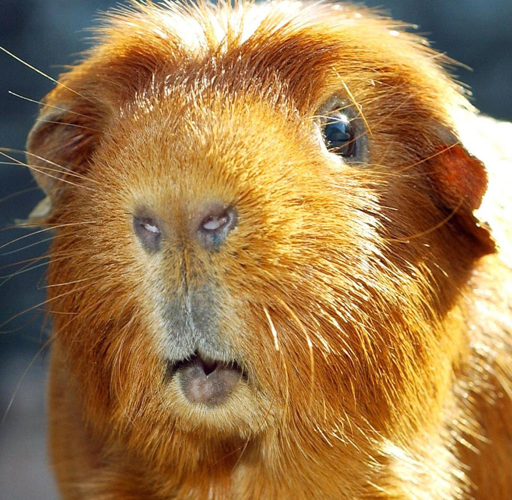

# Test Projekt
## zum testen und so
### total toll und so
#### super toll!

~~hier steht müll~~

1. erster eintrag in der liste
  1. unterliste
  
[sheet sheet](https://github.com/adam-p/markdown-here/wiki/Markdown-Cheatsheet)

Reference-style: 
![alt text][logo]

[logo]: https://github.com/adam-p/markdown-here/raw/master/src/common/images/icon48.png "Logo Title Text 2"

Markdown | Less | Pretty
--- | --- | ---
*Still* | `renders` | **nicely**
1 | 2 | 3

