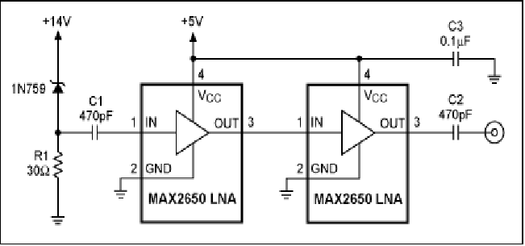
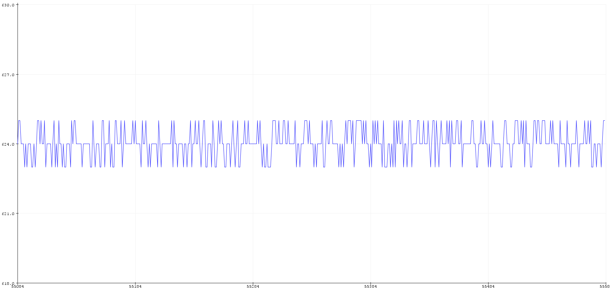
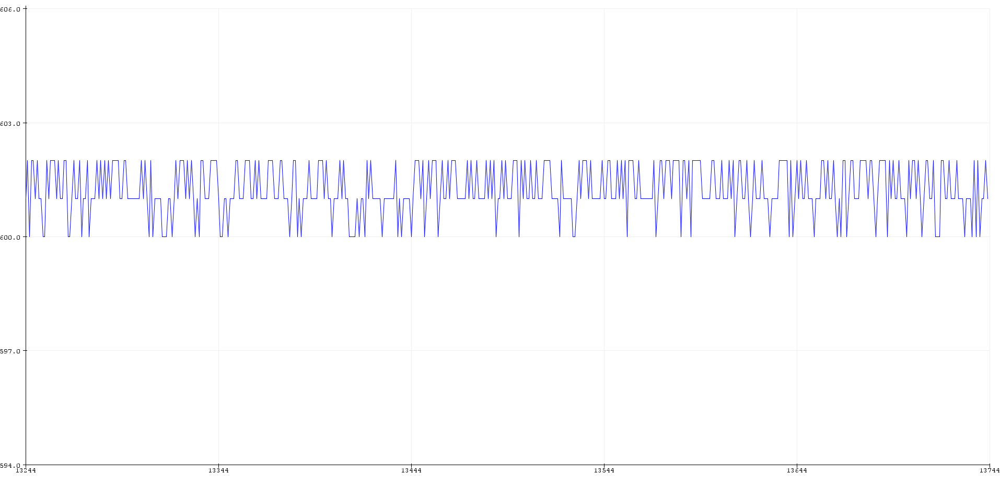
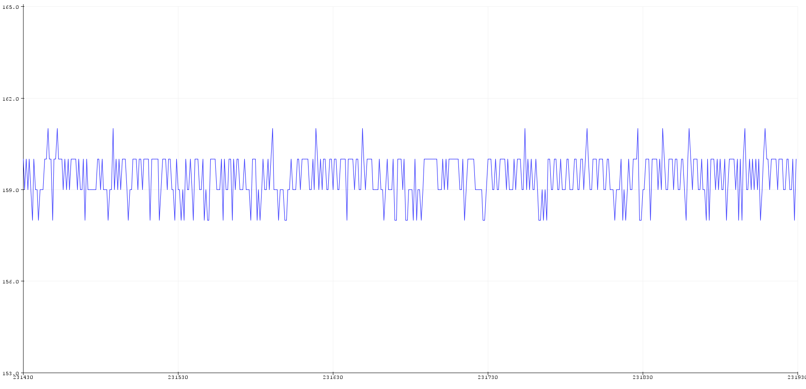
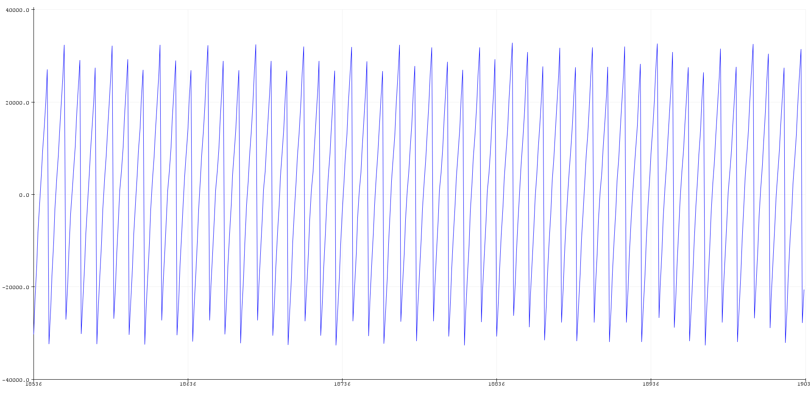
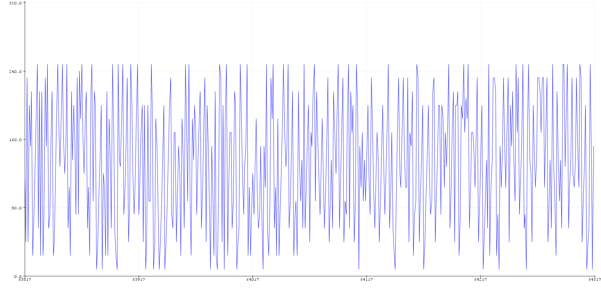
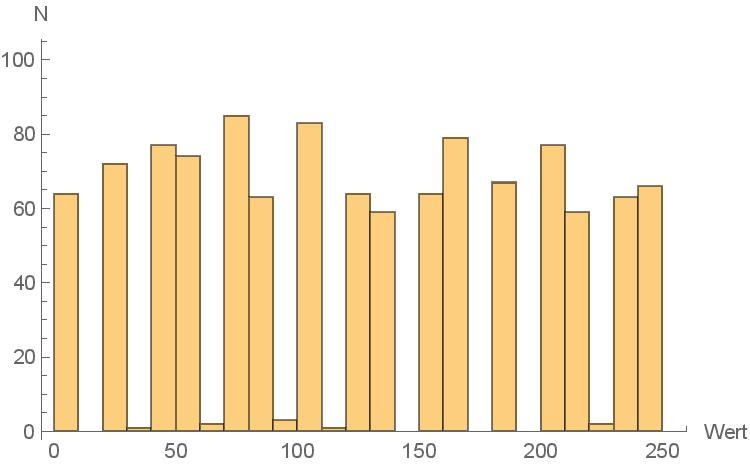

# Das Arduino-Experiment

## Ideenfindung
Zufallszahlen spielen im Alltag, in der Wissenschaft und der Informatik eine immer größer werdende Rolle. Da im Allg. die vom Computer erzeugten Pseudo-Zufallszahlen nicht wirklich zufällig sind und damit vorhersagbar, wollten wir uns damit beschäftigen anhand eines physikalischen Aufbaus echte Zufallszahlen zu erzeugen.\
Unter den beiden Möglichkeiten der experimentellen Bestimmung von Zufallszahlen: der quantenmechanischen und der mittels Rauschen, haben wir uns für letztere entschieden.\
Diese arbeitet damit, dass aufgrund der schweren Vorhersgbarkeit von physikalischen Anfangsbedingungen, in einem System Rauschen entsteht, das wiederun in Zufallszahlen umgewandelt werden kann.\
Da unsere exprimentellen Möglichkeiten diesbezüglich sehr eingeschränkt waren und wir keinen Zugang zu Hitech Instrumenten hatten, beschlossen wir einen möglichst einfachen, zu Hause erstellbaren Aufbau umzusetzten.

## Versuchsaufbau

Eine häufig benutzte Methode um Rauschen zu erzeugen sind Zener-Dioden, die man in der Durchbruchrichtung betreibt. Wie eine normale Diode lässt eine Zehner-Diode nur Strom in einer Richtung durch und in die andere (Sperrrichtung) wird der Strom blockiert. Das passiert aber nur bis zu einer bestimmten Spannung, der Durchbruchspannung, ab der die Diode auch in dieser Richtung leitet. Das sollte dann Spannungsrauschen durch den Avalanche-Effekt produzieren.[1] **reference** \
Nun wollen wir dieses Rauschen mit einem Arduino-Uno messen. Der Arduino-Uno ist ein Mikrocontroller, integriert auf einem Board mit Digitalen Ein- und Ausgängen sowie analogen Eingängen. Einer dieser analogen Eingänge soll nun benutzt werden, um die zeitabhängige Spannung an der Diode zu messen. Die aufgebaute Schaltung sah im Prinzip wie in diesem Aufbau aus [2]:\
\
Bei uns konnten wir leider nur Spannungen bis zu 9V an der Diode testen, da kein einstellbares Netzteil zur Verfügung stand und es wurden Operational-Amplifier (Op-Amps) anstatt der Low-Noise-Amplifier bei dem Aufbau auf der Webseite verwendet, da es leichter war an Op-Amps zu kommen.
Es Zener-Dioden mit 3.3V, 4.7V, und 7.5V getestet, da in die angelegte Spannung höher sein muss als die Durchbruchspannung der Diode, um den Avalanche-Effekt herbeizuführen. \
Der analoge Eingang des Arduino hat eine Auflösung von 10 Bit, also sind 1024 verschiedene Werte messbar und es können Spannungen von 0 bis 5 Volt gemessen werden, was zu einer Spannungsauflösung von ca. 5mV führt. Das Spannungsrauschen der Diode sollte also eine Amplitude von mehr als 5mV haben.

## Durchführung

Bei allen Messungen wurde ein Rauschen von ca. 10mV gemessen, was nicht ideal ist, da bei einer kleinen Amplitude nur ein kleiner Teil des Signals als Rauschen verwendet werden kann (das letzte Bit, bei einem Bit Rauschen). Es stellt sich aber heraus, dass dieses Rauschen allein von dem Analog-Digital-Converter des Arduino kommt, da ein sehr ähnliches Rauschen festgestellt werden konnte, wenn nur ein Spannungsteiler an den Eingang angeschlossen war. \
Es wurden viele verschiedene Verstärker Schaltungen getestet, AC-Coupled, DC-Coupled, Inverting und Non-Inverting, aber keine hatte den gewünschten Effekt der Aufweitung des Dioden-Rauschens gebracht.
Das sieht man an den Signalen, die mit dem ADC gemessen und per Serial plotter dargestellt werden:
\
\

## Messen des Rauschen des Arduino ADC

Da das Rauschen des Analog-Digital-Converters (ab jetzt ADC) anscheinend stärker als das Rauschen der Zenerdiode ist, bleibt uns nichts anderes übrig als dieses zu messen und zu schauen, wie zufällig es sich verhält. \
Zuerst betrachten wir den zeitlichen Verlauf des Signals direkt, was mit dem Serial-Plotter, des Arduino-Programs sehr leicht ist:\
\
Die x-Achse des Plots ist die Nummer des gesendeten Bytes und die y-Achse der Wert des Bytes. Da mit einer bestimmten Frequenz (9600 Bps) Bytes gesendet werden, ist die Zahl auf der x-Achse proportional zur vergangenen Zeit. Wie man sieht schwankt der Wert nur um 1 bit nach oben und unten, und das relativ regelmäßig. Um dies zu quantifizieren könnte man eine Frequenzanalyse mittels Fouriertransformation machen, was hier aber der einfachheit halber ausgelassen wurde, außerdem haben wir uns davon keine wichtigen Informationen erhofft.\ Stattdessen haben wir ein Programm geschrieben, welches misst, wie lange das Signal braucht um von einem Wert zu einem anderen zu wechseln. Das sieht dann wie folgt aus:\
\
Nun sieht das jetzt noch weniger zufällig aus, sondern genau nach dem Gegenteil von Zufall: Periodizität. Beim genaueren Betrachten der Werte fällt allerdings auf, dass das Signal nicht exakt periodisch ist und es Abweichungen bei den wenig signifikanten, also den hinteren Stellen der Zahlen gibt. Das könnte ein zufälliges Hintergrundrauschen sein, aus dem man zufallszahlen herausbekommen könnte.\ Also wird der gesendete Wert auf 8 bit trunkiert, d.h. die hinteren 8 Bits der Binärdarstellung der Zahl werden benutzt, der Rest wird verworfen. 8 bit ist hier recht willkürlich, die ganze Zahl ist eine unsigned long Variable mit 32 bit, aber 8 bit sind eben genau ein Byte, was berechnen von Datenraten einfacher macht. Diese 8 bit der Zeitmessung werden nun über die serielle Schnittstelle an den Computer weitergegeben, wo sie gespeichert werden kann. Die gesendeten Bytes sehen dann so aus: \
\
Das sieht schon mehr nach gewünschtem Rauschen aus, sehr unvorhersagbar. Nun wurden ca. 1000 aufeinanderfolgende Bytes gespeichert und um die Gleichverteilung zu überprüfen ein Histogramm angefertigt: \
\
Hier sieht man, wie häufig welche Zahlen in dem Datensatz vorkommen. Wenn es sich um gleichverteiltes Rauschen handeln sollte, müssten alle Bins gleich besetzt sein, also alle Balken gleich hoch. Dies ist aber offensichtlich nicht der Fall, es gibt sogar viele ganz leere Bins. Das zeigt uns erstmal, dass die Werte der Bytes überhaupt nicht gleichverteilt ist und so lässt sich auch vermuten, dass sie nicht zufällig sind. \
Wenn man die Zahlen näher betrachtet, fällt auf, dass von 256 Werten (8 Bit in Dezimal) nur 26 verschiedene Werte erhalten werden

### Testen der Erhaltenen Zahlen

## Auswertung

## Quellen
1. 
2. Building a Low-Cost White-Noise Generator (2005) https://www.maximintegrated.com/en/app-notes/index.mvp/id/3469
