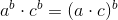



# Projektbeschreibung : Q-Tutorium - Die Zufallsmaschine (SoSe 2019)

Im Gegensatz zu üblichen Lehrveranstaltungen werden in dieser nicht nur
Forschungsthemen behandelt oder diskutiert, sondern selbstständig der
gesamte Forschungsprozess durchlaufen. Es werden von den Studierenden eigenständig Forschungsfragen formuliert und Schwerpunkte gesetzt. Es soll sich unter Anleitung der Tutoren (Paul Winter & Richard Kullmann) Literatur selbst gesucht und in Gruppen ein selbst ausgesuchtes Projekt gestaltet und für Dritte aufbereitet werden.

Das Abschlussprojekt des WiSe 2018/19 wurde auf der Langen Nacht der Wissenschaften [(offizielle Website)](https://www.langenachtderwissenschaften.de/) präsentiert. Die präsentierten Poster und ausgelegten Spiele und Experimente kannst du [hier] finden.

Diese Website soll die Ergebnisse des Tutoriums des SoSe 2019 präsentieren. 

# Projekte :

## Lineare Kongruenzgeneratoren

[Lineare Kongruenzgeneratoren](LCG/lcg.md)

## bestes Projekt:
[Pascal's Projekt](bestProject/test_project.md)

## super Projekt:
[Sarahs Projekt](sarah/sarah2.md)

# Website- Tests

Änderungen in index.md brauchen einige Minuten um auch auf der Website zu erscheinen.

Einige git-infos sind [hier](https://github.com/ZufallsmaschineSS19/ZufallsmaschineSS19.github.io/blob/master/gitInfos/git_terminal.md) zu sehen.

Anleitung zum editieren dieser Dateien [hier](https://github.com/adam-p/markdown-here/wiki/Markdown-Cheatsheet).

Test ob LaTeX sich hier anschalten laesst: $$r = \sqrt(r)$$

weiterer Test

