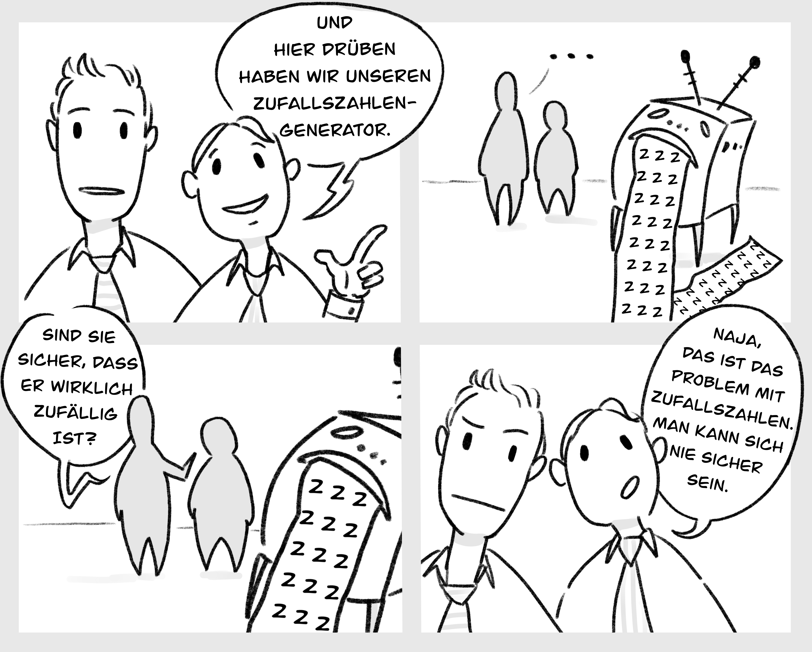
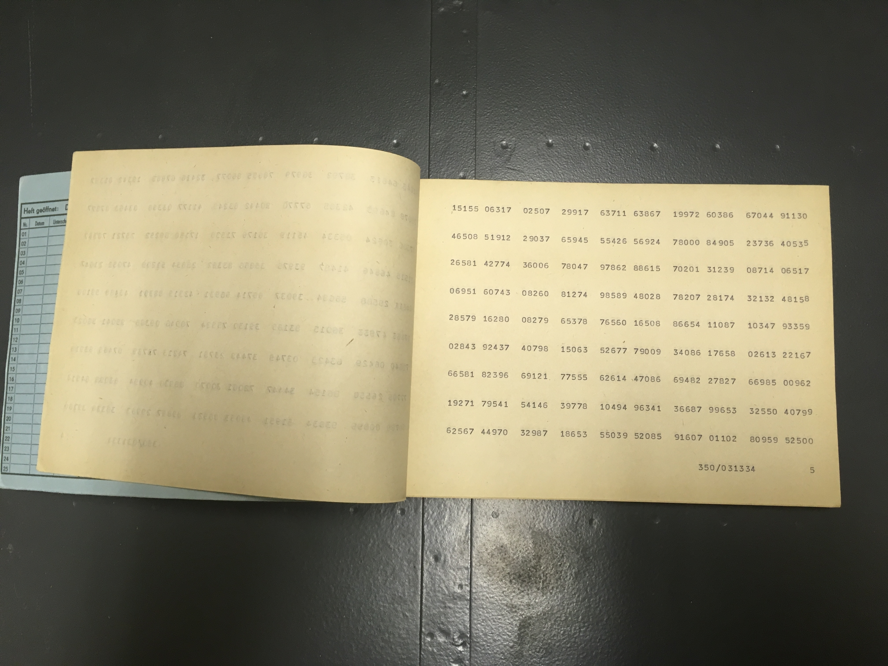
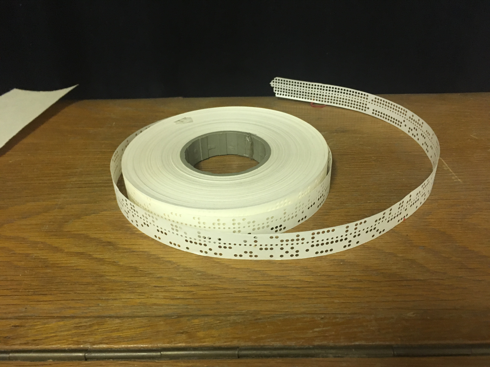
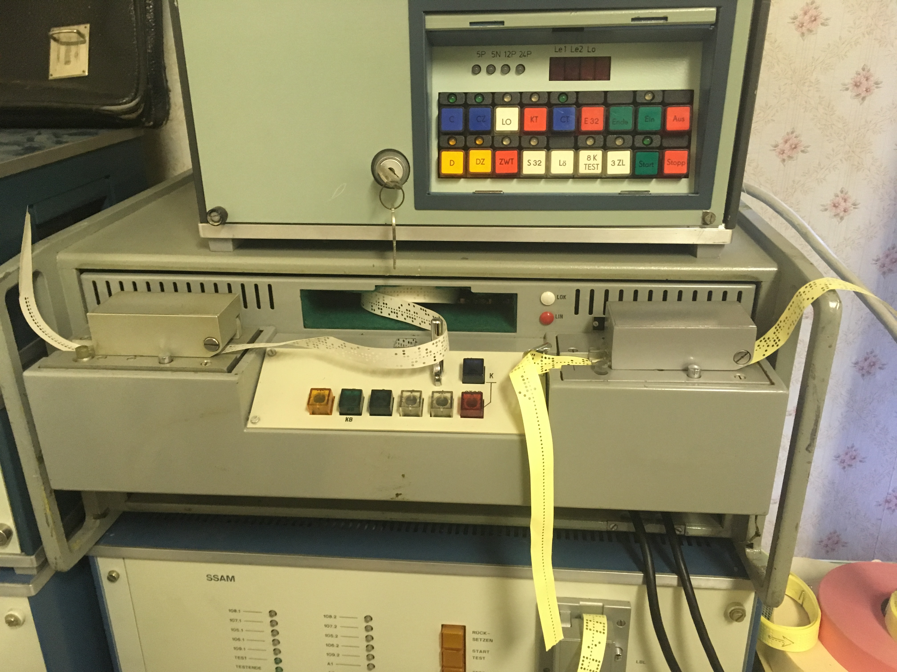

## Lange Nacht der Wissenschaften 2019

Zur Langen Nacht der Wissenschaften 2019 wurde unter dem
Veranstaltungsnamen "Die Zufallsmaschine" eine Ausstellung der
Abschlussprojekte des Wintersemesters 2018/19 durchgeführt. Dabei wurden
nachstehende Poster präsentiert. Beachte, dass die A0 Poster zum Teil größere Speicherkapazität brauchen und nicht sofort im Browser angezeigt werden - lade dazu die PDF erst runter um es dir schneller anzuschauen.

---

[Poster der Experiment-Gruppe](Poster_Experiment.pdf)

---

[Poster 1 der Statistik-Gruppe](poster_statistik_1.pdf)

---

[Poster 2 der Statistik-Gruppe](poster_statistik_2.pdf)

---

[Poster der Anwendungs-Gruppe](Poster_Anwendung.pdf)

---

### Das Trippel-Pendel alias *"Chaos-Pendel"*

[Video des Trippel-Pendels](spiele/Video_TrippelPendel_1.mp4)

### Mitmachspiele

---

Berechne mithilfe der *Monte-Carlo-Integration* und experimentell
erzeugten Zufallszahlen per Hand die Zahl **Pi** !

[Pi-Spiel](spiele/Pi-spiel.pdf)

---

Die Caesar-Verschlüsselng ist eine der ältesten und einfachsten Methoden
Nachrichten zu verschlüssel. Das Problem: Man kann die orginal
Caesar-Verschlüsselung recht einfach knacken! Versuche den einen
Schlüssel zu finden der den ganzen Satz wieder lesbar macht:

[Caesar-Raetsel](spiele/Caesar_Raetsel.pdf)

[Lösung des Caesar-Raetsels](spiele/Caesar_Loesung.pdf)

---

Erstelle eine mathematisch 100% sicher-verschlüsselte Nachricht und
schlage der NSA ein Schnippchen. Das **One-Time-Pad**, kurz **OTP**, ist
ein mächtiges Werkzeug und wurde auch schon im Kalten-Krieg von einer
viel Zahl von Spionen genutzt.

[OTP-Anleitung](spiele/OTP-Anleitung.pdf)

[OTP-Musterzettel](spiele/OTP_Hilfszettel.pdf)

---

Wie findet man raus, ob ein Würfel gezinkt ist. Jaja man kann ihn sich
anschauen, das Trägheitsmoment betrachten und feststellen: "Ja ne - er
taumelt.. ein nicht-gezinkter Würfel taumelt nicht.", aber was ist wenn
du nur die Zahlen gesagt bekommst oder dein gegenüber den Würffel nicht
rausrücken will...

[Würfelstatistik-Anleitung](spiele/Wuerfelstatistik_Anleitung.pdf)

[Strichlisten-Blatt](spiele/Wuerfelstatistik_Hilfszettel.pdf)

---

Was?! - Korrelation?! - hab ich noch nie gehört.. Das ist Zufall, dass
 neue Hitzerekorde gemessen werden, genau dann wenn das Klima
politisch ein Thema ist.

[Poster über Korrelationen und
Scheinkorrelationen](Poster_Korrelation.pdf)

[Korrelationsquiz] - comming soon

---

