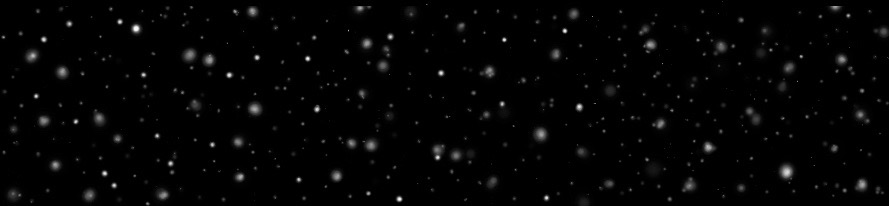

Sarah Pestkowski   -   Q-Tutorium: Die Zufalsmaschine.  -   Sommersemester 2019   
   

# 
Das Universum

# 
willkürlich - zufällig - chaotisch

## 
Eine philosophische Diskussion anhand des Buches „Der Zufall, das Universum und du“ von Florian Aigner

   
   

Willkür, Zufall und Chaos - diese drei Begriffe eignen sich sehr gut dazu, um im umgangssprachlichen Sinne das Universum zu beschreiben. Doch was genau beschreiben diese Begriffe eigentlich? Was bedeuten sie? Oder meinen sie vielleicht alle das gleiche? Wir wollen uns mit den Begriffen auseinander setzen, ihre Bedeutung verstehen und einen Zusammenhang zum Universum herstellen.

   
  
### 
Ist das Universum willkürlich?

Aus der Ferne betrachtet scheint es manchmal so, als ob im Universum viele Dinge willkürlich passieren. Laut der Herkunft des Wortes „Willkür“ bedeutet dies, dass das Universum ein die allgemein geltenden Gesetze missachtendes, an den eigenen Interessen ausgerichtetes und die eigene Macht nutzendes Handeln hervorbringen würde.[1] Doch kann man dem Universum eine solche Personifizierung und ein Bewusstsein für sein Handeln wirklich zusprechen? Kometen fliegen willkürlich durch das All, chemische Stoffe reagieren willkürlich miteinander, Genmutationen passieren willkürlich - all diese Beispiele basieren nicht auf der Willkür des Universums, sondern auf den darin existierenden Naturgesetzen. Kometen fliegen nicht willkürlich, sondern richten ihre Flugbahn nach den auf sie wirkenden Kräften und gespeicherten Energien aus. Ein Komet wird nicht von dem Willen des Universums entgegen der Naturgesetze durch das All bewegt. Das Universum übernimmt in diesem Zusammenhang keine aktive Rolle des Denkens oder Handelns. Ähnlich verhält es sich mit der Reaktion chemischer Stoffe. Zwei Stoffe reagieren aufgrund der chemischen Gesetze miteinander, aber nicht, weil es das Universum gerade so will. Doch wie verhält es sich mit der Genmutation? Eine Genmutation beschreibt die Veränderung des Erbgutes in nur einem Gen, es wird also lediglich eine Base verändert, entfernt oder hinzugefügt. Diese Mutation wird entweder durch eine fehlerhafte Replikation (Vervielfältigung) der DNA ausgelöst, oder ein Mutagen (äußere Einwirkung) verursacht einen Basenaustausch.[2] Genmutationen haben also verschiedene Ursachen, treten allerdings nicht willkürlich auf, denn auch hier kann nicht von dem aktiven Handeln des Universums gesprochen werden. Aus Willkür - also anhand des aus eigenem Willen ausgeführten Handelns - scheint das Universum nicht zu agieren.

   
  
### 
Ist das Universum zufällig?

Was bedeutet eigentlich Zufall? Eine häufige Definition von Zufall ist ein Ereignis, oder das Zusammenwirken vieler einzelner Ereignisse, für das man keine kausale Erklärung finden kann.[3] Florian Aigner sagte dazu:

_
“Ob wir etwas als zufällig betrachten, oder nicht, hängt davon ab, welche Informationen uns zur Verfügung stehen.“
_
   

Die Wahrnehmung von Zufall bedingt der grundlegenden Fähigkeit der Wahrscheinlichkeits-einschätzung.[3][4] Je weniger Informationen uns also zur Verfügung stehen, desto wahrscheinlicher werden wir ein Ereignis als zufällig einstufen. Von dieser Überlegung ausgehend können wir uns nun dem Zufall in der Quantenphysik zuwenden. Als promovierter Quantenphysiker versucht Florian Aigner seinen Lesern das Konzept des Zufalls durch quantenphysikalische Grundfragen wie etwa Schrödingers Katze, Quantenüberlagerung und Quantenverschränkung nahe zu bringen. In all diesen angewandten Beispielen hat man über das System nur minimale bis gar keine Informationen und der Ausgang des Experiments erscheint deshalb als zufällig. Gemeint ist in diesem Sinne, dass der Ausgang des Experiments nicht zuverlässig vorhersagbar ist, da eben die nötigen Informationen fehlen und somit auch der kausale Zusammenhang nicht ersichtlich wird. Es ist uns nicht möglich diese Ereignisse mittels Berechnungen und zugrunde liegender Naturgesetze exakt vorherzusagen oder einen kausalen Zusammenhang herzustellen. Doch ist das Universum nun als zufällig anzusehen? Nach der Definition von Florian Aigner bedeutet dies, dass es im Universum Ereignisse gibt, für die es unmöglich ist alle Informationen zu kennen, sodass der Ausgang des Experiments nicht zuverlässig vorhersagbar ist, also für uns zufällig erscheint. Er sagt weiterhin:

   
_
“Die Ergebnisse eines Quanten-Experiments kann man auch dann nicht vorhersagen, wenn man über das Versuchsobjekt alles weiß, was es zu wissen gibt.“
_
   

Wir haben es also mit echtem Zufall zu tun, wenn wir trotz vollständiger Informationen keine Aussage über den Ausgang des Experiments treffen können. Die Experimente der Quantenphysik und auch die auf dieser Website aufgeführten Experimente und Überlegungen zur Erzeugung von Zufallszahlen unterstützen also die Theorie, dass das Universum zufällig sei.

   

Zufall = Je weniger Informationen ich habe, desto eher sehe ich ein Ereignis als zufällig an

Echter Zufall = Selbst bei vollständiger Information kann ich das Ereignis nicht vorhersagen

   
  
### 
Ist das Universum chaotisch?

Der Begriff Chaos beschreibt einen Zustand der Unordnung und Planlosigkeit. [5] Die zwei Ausdrücke Universum und Chaos scheinen zunächst sehr gut zusammen zu passen. Denken wir zum Beispiel mal an den bekannten Begriff der Chaostheorie: Die Welt besteht aus einem verketteten Netz aus Ursachen und Wirkungen, das niemals in einzelne, voneinander getrennte Teile zerfällt - alles ist mit allem verbunden.[3] Die Chaostheorie greift genau an dieser Stelle und beschäftigt sich mit Ordnungen in dynamischen Systemen, deren zeitliche Entwicklung unvorhersehbar erscheint, obwohl die zugrundeliegende Theorie bekannt und deterministisch ist, also alle Ereignisse durch Vorbedingungen eindeutig festgelegt sind und theoretisch vorhersagbar sein müssten.[6] Einige Beispiele für die Chaostheorie sind der bekannte Butterfly-Effekt, Wirtschaftskreisläufe oder das Doppelpendel. Doch obwohl in der Theorie alle Parameter bekannt sind, ist es uns nicht möglich exakte Vorhersagen zu treffen, da die Systeme einfach zu komplex sind, um zuverlässige Vorhersagen berechnen zu können. Dies unterstützt die Behauptung, dass das Universum chaotisch sei, denn der Zustand des Systems kann von uns nicht vorhergesagt werden. Als weiteren Aspekt können wir uns den Quantenzufall anschauen. Bis zur Entwicklung der Theorien in der Quantenphysik ging man davon aus, dass jedes Ereignis im Universum einen Grund hat.[4] Nicht aber so beim Quantenzufall. Ob ein radioaktives Atom zerfällt oder nicht, ist nicht vorhersagbar, denn für dieses spontane Ereignis gibt es keine wirkliche Ursache, die den Zeitpunkt des Zerfalls bestimmt. Der radioaktive Zerfall eines einzelnen Atoms folgt also keinem Plan, sondern kann unvorhersehbar eintreffen. Ob der Zerfall eingetreten ist oder nicht, lässt sich erst durch eine Messung herausfinden, welche uns den sogenannten Quantenzustand und damit die Vorhersagbarkeit des Experiments kaputt macht.[4] Es wird aus den überlagerten Möglichkeiten eine ausgewählt - und diese Auswahl erfolgt nicht nach einem vorherbestimmten Plan. Auch dies unterstützt die Annahme von Chaos (und auch von Zufall) in unserem Universum.

   
  
### 
Das Universum - eine große Zufallsmaschine?

Die obigen Diskussionen der drei unterschiedlichen Begriffe Willkür, Zufall und Chaos zeigen auf, dass wir unser Universum durchaus als zufällig und chaotisch annehmen können - nicht aber als willkürlich. Zufall und Chaos treten im Universum also auf, ohne dass wir Einfluss darauf nehmen können. Während der Zufall daraus resultiert, dass wir jede Information über das System kennen mögen und doch keine zuverlässige Aussage darüber treffen können was geschehen wird, zeichnet sich das Chaos dadurch aus, dass bestimmte Informationen über ein System einfach nicht zu erfassen sind und es uns unmöglich ist darauf aufbauend exakte Vorhersagen zu treffen - lediglich die Wahrscheinlichkeiten des Eintretens bestimmter Ergebnisse lassen sich berechnen.[7] Unter all diese von Zufall und Chaos geprägten Phänomene fallen zum Beispiel die erwähnten quantenphysikalische Experimente, die Chaostheorie und auch die auf dieser Website behandelten Experimente zur Erzeugung von Zufallszahlen. Wir begegnen dem Zufall und Chaos fast täglich, in seiner verschiedensten Form und Ausprägung. Doch was für uns einfach nur nicht berechenbar und erfassbar ist, ist für das Universum eines seiner eindrucksvollen Mittel, um sich uns als eine riesige, große Zufallsmaschine zu präsentieren.

   

### 
Entsteht Zufall nur in unserem Kopf? - Eine philosophische Frage

Wir haben nun viel darüber debattiert, was Zufall und Chaos eigentlich sind, ob es Zufall im Universum gibt und wie man ihn erkennen kann. Doch in die philosophische Diskussion nach der Existenz von Zufall im Universum bindet Florian Aigner noch einen ganz anderen Aspekt ein:

   
  
_
“Zufall ist durch Unvorhersehbarkeit gekennzeichnet, von einem unvorhersehbaren, zufälligen Ereignis kann man aber nur sprechen, wenn es jemanden gibt, der etwas vorhersehen, bzw. als Zufall begreifen kann.“
_
   

Er drückt damit aus, dass Zufall keine Eigenschaft des Universums ist, sondern dass Zufall etwas ist, das erst durch uns und unser Denken zu einem realen Phänomen wird.[3]   
Wir können zunächst mal darüber nachdenken, wie viele zufällige Ereignisse zusammenspielen mussten, damit wir Menschen auf der Erde leben: Vom Materie-Verhältnis im Urknall, über die Bedingungen eines bewohnbaren Planeten, dem Zusammenfinden der richtigen Moleküle, damit eine Struktur ausgebildet werden kann, bis hin zur Evolution, die uns Menschen letztendlich zu dem geführt hat, was wir heute sind.[8] Wäre das Universum auch nur ein bisschen anders als wir es kennen, dann würde es uns vielleicht gar nicht geben.   
Anders herum kann es aber auch kein Universum geben, in dem sich jemand darüber wundert, dass aufgrund abweichender physikalischer Gesetze kein intelligentes Leben entstanden ist, dass es keinen bewohnbaren Planeten gibt oder dass die Moleküle keine Strukturen ausbilden können. Denn in einem solchen Universum gäbe es nämlich niemanden, der sich über so etwas überhaupt wundern könnte. Es gäbe dort auch keine Wissenschaft, die es erlaubt all diese Ereignisse als Zufall zu bezeichnen. [8]

   

_
“Gäbe es im ganzen Universum keine Planeten und kein Leben, dann hätte der Begriff Zufall gar keinen Sinn. Nicht wir Menschen sind da, weil uns der Zufall hervorgebracht hat, sondern der Zufall ist da, weil wir Menschen ihn hervorbringen.“
_
   

Wie könnte man von Unvorhersehbarkeit sprechen, wenn es uns, die etwas vorhersehen können, nicht geben würde? Was soll ein Erwartungswert sein, wenn niemand etwas erwartet?[8]

   

Ob wir etwas als Zufall ansehen, hängt häufig vom Betrachter ab. Ein Kind, das viermal hintereinander eine sechs würfelt, wird sich einfach nur freuen, während ein Erwachsender dieses Ereignis als großen Zufall einstufen wird. Zufall ist geknüpft an unsere Erwartungen, Erfahrungen und Hoffnungen. Zufall bezeichnet die Unerklärlichkeit in der Welt. Egal, ob die Gesetze der Natur es nicht erlauben die nötige Information zu finden oder ob uns die Information bloß fehlt oder wir nicht darüber nachdenken wollen; wir können es nicht wissen oder nicht herausfinden, also nennen wir es Zufall.[8]   
Wir Menschen suchen stets nach Ursachen in der Welt. Wir wollen auf jede Frage eine Antwort finden - doch jede Antwort wirft zugleich neue Fragen nach noch tieferen Ursachen auf. Irgendwann wird man sich damit abfinden müssen, dass sich - zumindest vorerst - keine Antworten mehr finden lassen. Zufall ist für uns das, worauf uns die Antworten fehlen.[8]

   

Der Zufall ist nicht im Universum verankert, sondern er ist eine Eigenschaft, die erst in unseren Köpfen entsteht. Zufall bedeutet, dass wir die Welt nicht endgültig verstehen können, dass wir Überraschungen erleben, dass Wunder geschehen, dass Hoffnungen erfüllt werden, überall und jeden Tag.[8]

   
   
   
## Quellen
[1] vgl. https://www.duden.de/rechtschreibung/Willkuer (Stand: 23.06.2019)   
[2] vgl. https://de.wikipedia.org/wiki/Genmutation (Stand: 23.06.2019)   
[3] vgl. https://hpd.de/artikel/zufall-universum-und-du-13970 (Stand: 23.06.2019)   
[4] vgl. https://www.naklar.at/content/features/quantenzufall/ (Stand: 23.06.2019)   
[5] vgl. https://de.wikipedia.org/wiki/Chaos (Stand: 23.06.2019)   
[6] vgl. https://de.wikipedia.org/wiki/Chaosforschung (Stand: 23.06.2019)   
[7] vgl. https://www.sueddeutsche.de/kultur/buch-ueber-den-zufall-wie-viel-einfluss-haben-wir-auf-unser-schicksal-1.3345831 (Stand: 23.06.2019)   
[8] Florian Aigner: Der Zufall, das Universum und du. Die Wissenschaft vom Glück, Christian Brandstätter Verlag, Wien, 2. Auflage 2017
